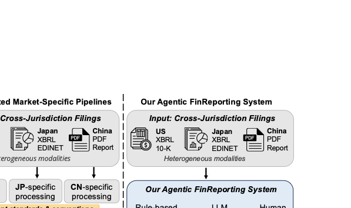
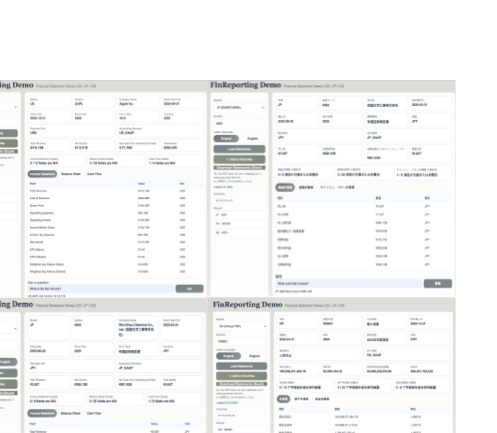

<h1 align="center">FinReporting: An Agentic Workflow for Localized Reporting of Cross-Jurisdiction Financial Disclosure</h1>

<p align="center">
Fan Zhang, Mingzi Song, Rania Elbadry, Yankai Chen, Shaobo Wang, Yixi Zhou, Xunwen Zheng, Yueru He, Yuyang Dai, Georgi Nenkov Georgiev, Ayesha Gull, Muhammad Usman Safder, Fan Wu, Liyuan Meng, Fengxian Ji, Junning Zhao, Xueqing Peng, Jimin Huang, Yu Chen, Xue Liu, Preslav Nakov, and Zhuohan Xie
</p>

<p align="center">
  <a href="https://aclanthology.org/2026.acl-demo.71/"></a>
  <a href="https://aclanthology.org/2026.acl-demo.71.pdf"></a>
  <a href="https://github.com/ZF-Utokyo/FinReporting"></a>
  <a href="https://huggingface.co/spaces/BoomQ/FinReporting-Demo"></a>
  <a href="https://www.youtube.com/watch?v=f65jdEL31Kk"></a>
</p>

<p align="center">
  <a href="imgs/fig1.pdf">
    
  </a>
</p>

FinReporting extracts, maps, verifies, and exports localized financial statements from annual disclosures across the United States, Japan, and China. It combines deterministic filing-specific extraction with constrained LLM verification, keeping every repair decision grounded in evidence rather than free-form generation.

<p align="center">
  <a href="imgs/sys4.pdf">
    
  </a>
</p>

## Overview

Financial disclosures vary sharply across jurisdictions. US and JP filings expose structured XBRL signals, while CN annual reports often require PDF table localization and schema matching. FinReporting handles this heterogeneity through a staged, auditable workflow:

- Filing acquisition from public market-specific sources.
- Rule-based extraction for structured XBRL and semi-structured PDF statements.
- Canonical mapping into income statement, balance sheet, and cash flow fields.
- Anomaly-aware logging for missing, conflicting, or suspicious values.
- LLM verification and repair under explicit guardrails and evidence requirements.
- Excel export for localized inspection and downstream evaluation.

The public repository is intentionally data-light: it contains source code, schemas, small toy manifests, and evaluation utilities, but not raw annual-report caches, generated model outputs, API keys, or human-checked spreadsheets.

## Repository Contents

```text
.
|-- README.md
|-- requirements.txt
|-- run_smoke_test.py                  # No-data environment and artifact check
|-- run_example.py                     # Unified CN / US / JP example runner
|-- schemas/
|   `-- CN_Schemas.xlsx                # Runtime schema for CN PDF matching
|-- CN/
|   |-- export_three_statements_excel_cn.py
|   `-- convert_three_statements_readable.py
|-- US/
|   |-- export_three_statements_excel.py
|   |-- extract_xbrl_cash_flow.py
|   |-- download_raw_pdfs.py
|   `-- convert_three_statements_readable.py
|-- JP/
|   |-- export_three_statements_excel_jp.py
|   |-- download_edinet_zip_no_key.py
|   `-- convert_three_statements_readable.py
|-- eval/
|   |-- run_batch_pipeline.py
|   |-- run_llm_only_cn.py
|   |-- run_llm_only_us.py
|   |-- run_llm_only_jp.py
|   |-- compute_four_way_ablation_metrics.py
|   `-- table2exp/
|-- examples/
|   |-- companies_sample.csv
|   `-- sample_manifest.csv
`-- imgs/
    |-- fig1.pdf / overview.png
    |-- pipeline.pdf / pipeline.png
    `-- sys4.pdf / system.png
```

## Pipeline

| Stage | Component | Purpose | Main output |
|---|---|---|---|
| 0 | Filing acquisition | Locate or load annual disclosures from SEC, EDINET, or CNINFO/local PDF | Filing metadata and source file |
| 1 | Rule extraction | Parse XBRL facts or PDF statement tables | Raw market-specific fields |
| 2 | Canonical mapping | Normalize fields into three-statement ontology | `*_3statements.xlsx` |
| 3 | LLM verify/repair | Check rule values with evidence-grounded decisions | Audit CSV / workbook sheet |
| 4 | Evaluation | Build manual review templates and ablation metrics | Accuracy and workload reports |

## Quick Start

Create an environment and install dependencies:

```bash
python -m venv .venv
source .venv/bin/activate
pip install -r requirements.txt
```

Run a no-data smoke test:

```bash
python run_smoke_test.py
```

The smoke test checks repository files, Python syntax, and the CN schema workbook. If package checks fail, install the dependencies above and rerun.

## Running Examples

The unified runner is the recommended entry point.

US can run directly from public SEC XBRL data:

```bash
python run_example.py us \
  --symbol AAPL \
  --cik 0000320193
```

CN requires a local annual-report PDF:

```bash
python run_example.py cn \
  --symbol 300750 \
  --pdf /path/to/annual_report.pdf
```

JP can run from a local EDINET type-1 ZIP:

```bash
python run_example.py jp \
  --symbol 7203 \
  --company-name "Toyota" \
  --xbrl-zip /path/to/edinet_type1.zip
```

Outputs are written to `outputs/` by default. Generated outputs are ignored by git.

## Environment Variables

Rule-only extraction does not require LLM keys. LLM verification and repair use provider API keys from environment variables or explicit CLI arguments.

```bash
cp .env.example .env
```

Supported variables:

```text
OPENAI_API_KEY=
GEMINI_API_KEY=
DEEPSEEK_API_KEY=
ANTHROPIC_API_KEY=
```

Optional variables:

- `EDINET_API_KEY`: only needed for JP EDINET API mode. The local ZIP workflow does not require it.
- `SEC_USER_AGENT`: optional custom SEC request identity. The US scripts provide a default value.

Do not commit real keys.

## Data and Safety

This repository does not track raw filings, generated outputs, model traces, or human-checked spreadsheets. Prepare your own public filings and write generated artifacts to local ignored folders such as `outputs/`, `CN/raw_pdfs/`, `US/raw_pdfs/`, or `JP/jp_zips/`. Toy input formats are shown in `examples/`.

Before publishing derived outputs, review them for source-document text, audit traces, or manual labels that should not be released.

## Citation

If you use FinReporting, please cite the ACL 2026 System Demonstrations paper:

```bibtex
@inproceedings{zhang-etal-2026-finreporting,
    title = "{F}in{R}eporting: An Agentic Workflow for Localized Reporting of Cross-Jurisdiction Financial Disclosure",
    author = "Zhang, Fan  and
      Song, Mingzi  and
      Elbadry, Rania  and
      Chen, Yankai  and
      Wang, Shaobo  and
      Zhou, Yixi  and
      Zheng, Xunwen  and
      He, Yueru  and
      Dai, Yuyang  and
      Georgiev, Georgi Nenkov  and
      Gull, Ayesha  and
      Safder, Muhammad Usman  and
      Wu, Fan  and
      Meng, Liyuan  and
      Ji, Fengxian  and
      Zhao, Junning  and
      Peng, Xueqing  and
      Huang, Jimin  and
      Chen, YU  and
      Liu, Xue  and
      Nakov, Preslav  and
      Xie, Zhuohan",
    editor = "Durrett, Greg  and
      Jian, Ping",
    booktitle = "Proceedings of the 64th Annual Meeting of the {A}ssociation for {C}omputational {L}inguistics (Volume 3: System Demonstrations)",
    month = jul,
    year = "2026",
    address = "San Diego, California, United States",
    publisher = "Association for Computational Linguistics",
    url = "https://aclanthology.org/2026.acl-demo.71/",
    pages = "728--735",
    ISBN = "979-8-89176-392-0"
}
```
